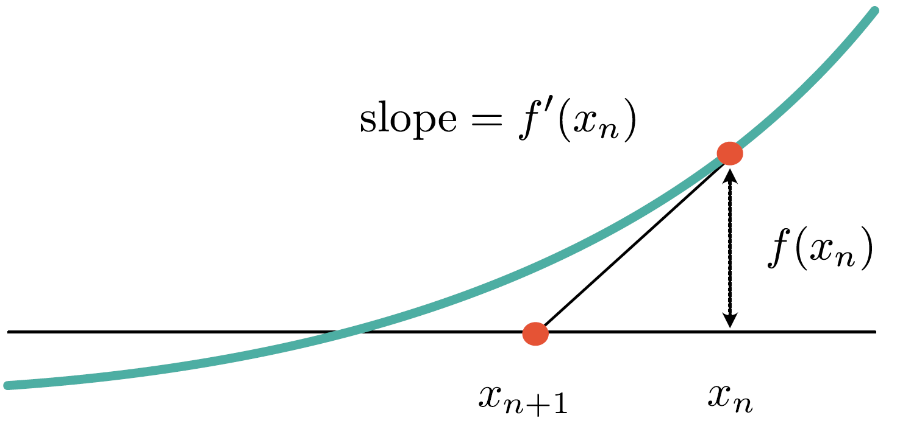
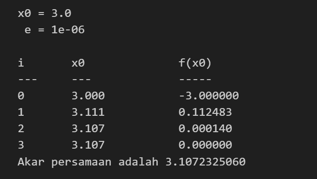
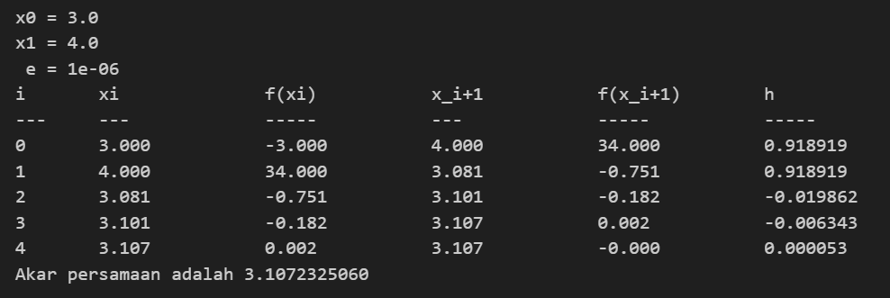

# Newton-Raphson
## Teori

Pada metode-metode sebelumnya, kita memerlukan dua titik tebakan awal untuk berikutnya menentukan ke mana nilai $x$ akan digeser. Metode ini disebut metode tertutup.

Metode terbuka menawarkan alternatif sehingga cukup dengan satu titik tebakan dapat menentukan ke arah mana nilai $x$ akan digeser. Metode ini memanfaatkan prinsip turunan fungsi sebagai kemiringan di satu titik. Diambil garis linier dari titik $f(x)$ dengan kemiringan tersebut. Kemudian perpotongan garis tersebut pada sumbu-x menghasilkan nilai $x$ selanjutnya. 

*Gambar dari: [Sumber Gambar](https://www.eigenplus.com/newton-raphson-method/)*

Mencari kemiringan garis linier yang melewati titik $(x_n, f(x_n))$ dan $(x_{n+1}, 0)$

$$
\frac{\Delta y}{\Delta x} = \frac{y_b - y_a}{x_b - x_a} = \frac{f(x_n) - 0}{x_n - x_{n+1}} \text{ atau } \frac{f(x_n)}{x_n - x_{n+1}}
$$

Secara konsep, kemiringan tersebut adalah sama dengan hasil turunan fungsi pada absis $x_n$.

$$
\begin{array}{rl}
f'(x_n) &= \frac{f(x_n)}{x_n - x_{n+1}}\\
x_n - x_{n+1} &= \frac{f(x_n)}{f'(x_n)}\\
x_{n+1} &= x_n - \frac{f(x_n)}{f'(x_n)}
\end{array}
$$

## Percobaan
Program akan meminta dua (2) buah masukan.
- Masukan pertama adalah float untuk batas error yang diinginkan
- Masukan berikutnya adalah float sebagai nilai $x_0$

Contoh masukan: `0.000001` dan `3.0`

# Secant
## Teori
Metode Newton-Raphson sudah menyuguhkan cara yang praktis dalam mencari akar persamaan, yaitu dengan hanya menentukan satu titik tebakan awal.

Metode Secant mengatasi kelemahan dari metode Newton Raphson, yakni potensi sulitnya menentukan turunan dari suatu fungsi. Kebutuhan bentuk turunan dari fungsi digantikan dengan penjabaran turunan sebagai perubahan/kemiringan antara dua titik. 

$$
\begin{aligned}
f'(x)\rightarrow \text{ kemiringan }&=\frac{\Delta y}{\Delta x}\\
&=\frac{y_2-y_1}{x_2-x_1}\\
f'(x)&=\frac{f(x_n)-f(x_{n-1})}{x_n-x_{n-1}}
\end{aligned}
$$

Formula penentuan $x_{n+1}$ pada metode Newton-Raphson dimodifikasi sebagai berikut.

$$
\begin{aligned}
x_{n+1}&=x_n-\frac{f(x_n)}{f'(x_n)}\\
&=x_n-\frac{f(x_n)}{\frac{f(x_n)-f(x_{n-1})}{x_n-x_{n-1}}}\\
x_{n+1}&=x_n-\frac{f(x_n)(x_n-x_{n-1})}{f(x_n)-f(x_{n-1})}
\end{aligned}
$$

## Percobaan
Program akan meminta tiga (3) buah masukan.
- Masukan pertama adalah float untuk batas error yang diinginkan
- Dua masukan berikutnya adalah float sebagai nilai $x_0$ dan $x_1$

Contoh masukan: `0.000001`, `3.0`, dan `4.0`

#
**Catatan Tambahan** 
Gunakan angka dengan nilai $f(x)$ tidak terlalu besar (mencapai ribuan). Program hanya menerapkan *tab* sederhana, tidak menyesuaikan panjang kata sebelumnya.

# Referensi
Newton Raphson Method: Overview, Formula and Easy graphical interpretation. Eigenplus. [Link](https://www.eigenplus.com/newton-raphson-method/)