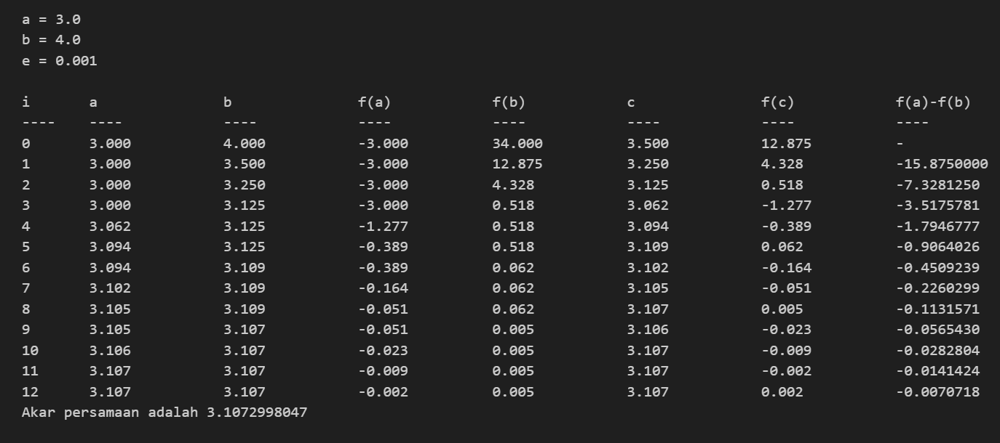
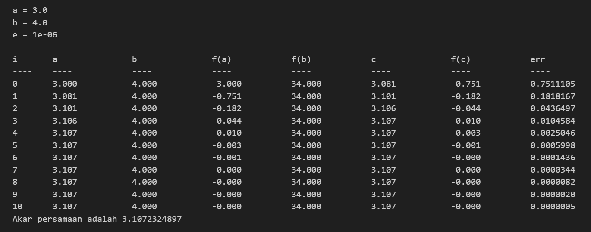

# Biseksi
## Teori
Metode Biseksi bekerja dengan menetapkan dua titik absis awal, disebut $a$ dan $b$, dengan nilai $f(a)$ dan $f(b)$ yang terpisah oleh sumbu-x. Dengan kata lain, terdapat sebuah titik potong dengan sumbu-x di antara kedua titik tersebut.

Memeriksa apakah $a$ dan $b$ dipisahkan oleh sumbu-x dapat dilakukan dengan mengalikan ordinat keduanya. Jika terpisah oleh sumbu-x maka hasil kalinya pasti bernilai negatif karena salah satu titik berada di bawah sumbu-x (ordinatnya lebih kecil dari 0) dan yang lainnya di atas sumbu-x.

$a$ dan $b$ harus memenuhi: $f(a) * f(b) < 0$

(p pada ilustrasi di atas adalah titik tengah a dan b)

Kemudian kita menandai titik tengah antara dua absis tersebut, lalu menggunakan titik tersebut beserta salah satu titik sebelumnya dengan syarat masih mengapit titik potong yang sedang dicari. Demikian dilakukan terus-menerus hingga semakin mendekati titik potong tersebut.

Titik tengah = $(a + b) \over 2$

## Percobaan
Program akan meminta dua (3) buah masukan.
- Masukan pertama adalah float untuk batas error yang diinginkan
- Dua masukan berikutnya adalah float sebagai nilai `a` dan `b`

Contoh masukan: `0.001`, `3.0`, dan `4.0`

# Regula Falsi
## Teori

Metode Regula Falsi juga diawali dengan memilih dua titik dengan nilai $f(x)$ yang dipisahkan oleh sumbu-x. Perbedaanya dengan Metode Biseksi adalah prinsip penentuan titik $c$ berikutnya.

|  | Biseksi | Regula Falsi | Metode Terbuka |
| --- | :---: | :---: | :---: |
| Nilai awal yang dibutuhkan [^1] | $a$, $b$ | $a$, $b$ | $a$ |
| Titik acuan baru di iterasi berikutnya | titik tengah $a$ dan $b$ | titik potong garis penghubung $f(a)$ dan $f(b)$ dengan sumbu-x | *di chapter lain* |

[^1]: Nilai batas error yang diinginkan selalu dibutuhkan dalam semua metode untuk 

Pada Metode Regula Falsi, titik berikutnya diambil dari perpotongan garis hubung antara $f(a)$ dan $f(b)$ dengan sumbu-x.

( $g(x)$ pada ilustrasi di atas adalah garis penghubung antara $f(a)$ dan $f(b)$ )

## Percobaan

Program akan meminta dua (3) buah masukan.
- Masukan pertama adalah float untuk batas error yang diinginkan
- Dua masukan berikutnya adalah float sebagai nilai `a` dan `b`

Contoh masukan: `0.001`, `3.0`, dan `4.0`

#
**Catatan Tambahan** 
Gunakan angka dengan nilai $f(x)$ tidak terlalu besar (mencapai ribuan). Program hanya menerapkan *tab* sederhana, tidak menyesuaikan panjang kata sebelumnya.
