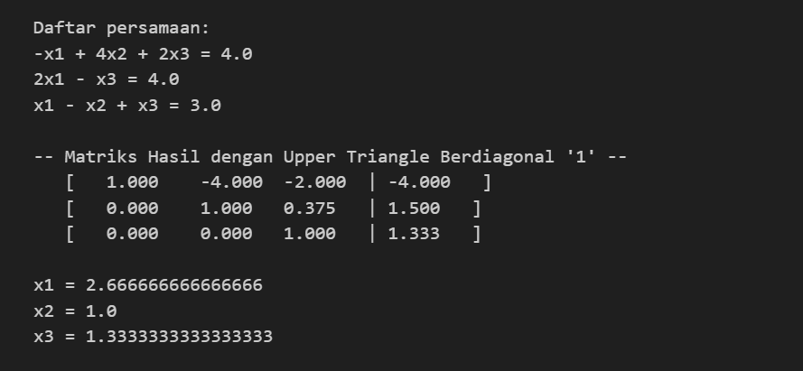

# Metode Eliminasi Gauss
## Teori
Dalam mencari penyelesaian Sistem Persamaan Linier dengan $n$ variabel, diperlukan $n$ buah persamaan diketahui. Persamaan-persamaan yang diketahui dapat diekspresikan dalam persamaan operasi perkalian suatu matriks.

$$
\begin{aligned}
p_1x + q_1y + r_1z &= d_1 \\
p_2x + q_2y + r_2z &= d_2 \\
p_3x + q_3y + r_3z &= d_3
\end{aligned}
\quad \rightarrow \quad
\left(\begin{array}{ccc}
    p_1 & q_1 & r_1 \\
    p_2 & q_2 & r_2 \\
    p_3 & q_3 & r_3
\end{array}\right)
\left(\begin{array}{c}
    x \\ y \\ z
\end{array}\right)
=
\left(\begin{array}{c}
    d_1 \\ d_2 \\ d_3
\end{array}\right)
$$

Pada metode ini, matriks lengkap SPL yang terdiri dari koefisien setiap persamaan beserta konstanta ruas kanan diberikan serangkaian operasi baris elementer (OBE). Perlakuan OBE pada matriks tidak mengubah nilai persamaan. OBE antara lain,
- menukar tempat dua buah persamaan (tukar baris)
- mengalikan satu persamaan (satu baris penuh) dengan suatu konstanta bukan 0
- menjumlahkan satu persamaan/baris dengan persamaan/baris lain
    - tetap berlaku: suatu baris boleh dikalikan konstanta tertentu bukan 0

Target dari metode Eliminasi Gauss adalah menemukan matriks segitiga atas dari matriks SPL-nya.

$$
\left(\begin{array}{ccc|c}
    1 & a & b & k_1 \\
    0 & 1 & c & k_2 \\
    0 & 0 & 1 & k_3
\end{array}\right)
\rightarrow
\left(\begin{array}{ccc}
    1 & a & b \\
    0 & 1 & c \\
    0 & 0 & 1
\end{array}\right)
\left(\begin{array}{c}
    x \\ y \\ z
\end{array}\right)
=
\left(\begin{array}{c}
    k_1 \\ k_2 \\ k_3
\end{array}\right)
$$

Jika sudah ditemukan matriks segitiga atas, solusi variabel terakhir dapat ditemukan. Penentuan solusi lainnya dapat diselesaikan dengan teknik substitusi.

$$
\begin{aligned}
x + ay + bz &= k_1 \\
y + cz &= k_2 \\
z &= k_3
\end{aligned}
$$

## Percobaan
### Contoh 1
Banyak variabel: 2
Masukan untuk persamaan:
> 3 -1 4 
> -2 2 2

### Contoh 2
Banyak variabel: 3
> -1 4 2 4 
> 2 0 -1 4 
> 1 -1 1 3

### Contoh 3
Banyak variabel: 4
> 1 1 0 -2 1 
> 2 -1 3 1 4 
> -3 1 -2 2 4 
> 4 1 0 -1 2

## Pengerjaan secara Tradisional

